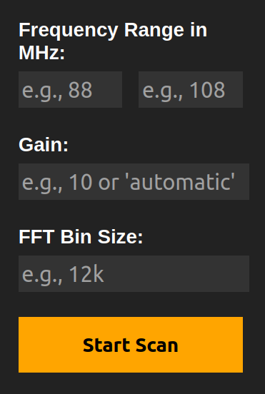
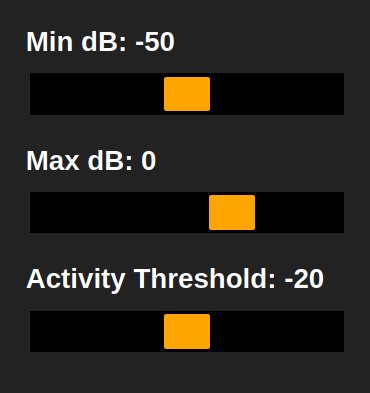

# STK Sweep Setup Instructions

This README provides detailed instructions on how to set up the STK Sweep server, as well as usage documentation. Follow these steps to get started.

## Prerequisites

Before proceeding, ensure you have the following installed on your system:
- Python 3
- `pip` (Python package manager)
- `unzip` utility
- `rtl-sdr` package, including `rtl_tcp` and `rtl_power`

## Installation and Setup

1. **Unzip the Source Code:**
   Unzip the `SDR-STK-dev.zip` file to extract the source code.
   ```bash
   unzip STK_SWEEP-dev.zip
   ```

2. **Navigate to the Project Directory:**
   Change your current directory to the `SDR-STK-dev` folder.
   ```bash
   cd SDR-STK-dev/
   ```

3. **Create a Python Virtual Environment:**
   Set up a Python virtual environment to manage dependencies.
   ```bash
   python3 -m venv venv
   ```

4. **Activate the Virtual Environment:**
   Activate the newly created virtual environment.
   ```bash
   source venv/bin/activate
   ```

5. **Install Dependencies:**
   Install the required Python packages using `pip`.
   ```bash
   python -m pip install -r requirements.txt
   ```

6. **Run the Flask Application:**
   Start the Flask application.
   ```bash
   python stk_sweep.py
   ```

## Usage

After completing the setup, the Flask application will be running on your local server. You can access it via `localhost:5000/rtl_data`.

1. Enter the desired wideband scan range and bin size and start the scan.

2. Start the `rtl_tcp` server with the desired port and IP, and connect to it with your SDR software

3. `ctrl + left click` on a frequency and STK Sweep will automatically tune your 2nd SDR to it.

## Settings and Configuration

**Wideband Settings**

Enter the freqency range, gain, and bin size.

- Gain should be between 0-50, or "automatic".
- The bin size is in Hz, and sets the frequency range that each pixel covers. Lower bin size, more resolution.



**Waterfall Display Settings**

This sets the color profile for each new row of the waterfall. Future versions will update the entire waterfall color scheme.

The `Activity Threshold` slider sets the threshold for the activity bar.



**RTL TCP Settings**

This is for starting the backend `rtl_tcp` server. `STK Sweep` has a TCP proxy on the backend in order to be able to update the center frequency of the 2nd RTL-SDR dongle.


## Support

For any issues or questions, please refer to `<coming_soon>` documentation or contact us.

## Contributing

Contributions to the SDR-STK project are welcome. Please read the `CONTRIBUTING.md` file for guidelines on how to contribute.

## To-Do

**Bug Fixes:**
- Frontend breaks with really wide scan
- Buttons don't turn red on `stop`
- ~~Exception catches on backend~~
- Large `bin` size breaks `drawRow()` in `rtlDataDisplay.js`

**Aditional Features:**
- Custom wideband backend
- Zoom and scroll relative to page center/mouse cursor
- Add documentation
- Add license
- Add usage docs
- Add more `rtl_power` options
- Add page settings
- Update entire waterfall colors
- Automatic gain on frontent

---

Thank you for participating in the STK Sweep project development.
