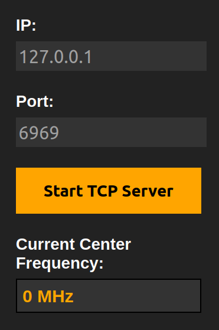
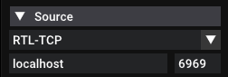
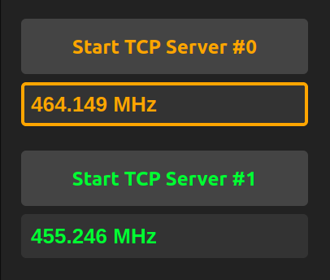
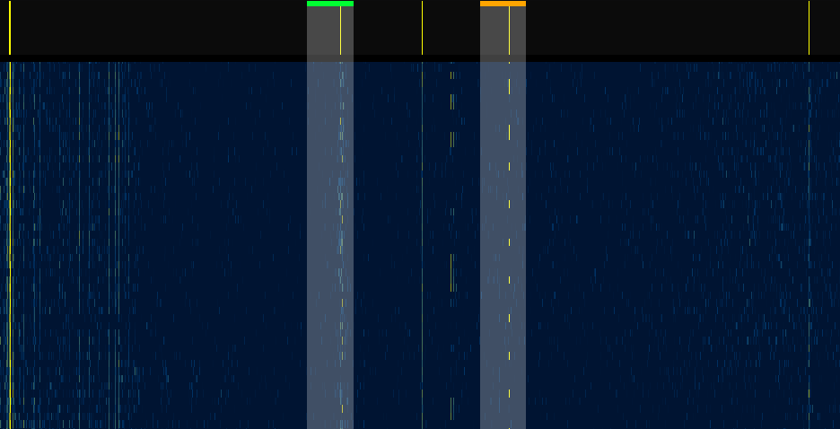

# STK Sweep Setup Instructions

**Version 0.2.1**

## Prerequisites

Before proceeding, ensure you have the following installed on your system:
- Python 3
- `pip` + `virtualenv`
- `rtl-sdr` package, including `rtl_tcp` and `rtl_power`
- `hackrf_sweep` for the [HackRF](https://github.com/greatscottgadgets/hackrf)
-  Optionally `docker`

## Installation and Setup

Before starting STK Sweep, make sure that you have the backend tools like rtl_tcp, rtl_power, or hackrf_sweep installed and updated to the most current version. If you're on Windoze, make sure that you have these in your system PATH. Instuctions for all this can be found with some quick Googleing. 

1. **Clone the Source Code**
   ```bash
   git clone https://github.com/fosatech/STK-Sweep.git
   ```

2. **Navigate to the Project Directory**
   ```bash
   cd STK-Sweep/
   ```

3. **Create a Python Virtual Environment:**
   ```bash
   python3 -m venv venv
   ```

4. **Activate the Virtual Environment:**
   ```bash
   source venv/bin/activate
   ```

5. **Install Dependencies:**
   ```bash
   python -m pip install -r requirements.txt
   ```

6. **Run the Flask Application:**
   ```bash
   python stk_sweep.py
   ```
   Note: this currently starts the Flask development server. Proper WSGI server support is coming soon.

## Docker

Dockerfile and docker-compose.yml files have been added to the repo.

To build and run application run the following command
```bash
./startContainer.sh
```

Additionally, the Docker image is built with GitHub actions on the main branch.

If you open up the docker-compose.yml and modify this line:

```yml
    image: sweep
```

to be

```yml
    image: ghcr.io/fosatech/stk-sweep:latest
```

Then run `docker compose run --publish 5000:5000 stk_sweep` to start the container

This bash script will build the docker image from the Docker file and then run the container from the docker compose file.

## Usage

After completing the setup, the Flask application will be running on your local server. You can access it via `localhost:5000/rtl_data`.

1. Open the settings window, enter the desired wideband scan range and bin size, and start the scan.

2. Start the `rtl_tcp` server with the desired port and IP, and connect to it with your SDR software.

3. Select your desired rtl-tcp server instance by clicking on the current frequency, then `ctrl + left click` on the wideband window and STK Sweep will automatically tune your SDR to it.

## Settings and Configuration

**Wideband Settings:**

Enter the freqency range, gain, and bin size.

- Gain for the rtl-sdr should be between 0-50, or "automatic".
- Gain for the hackrf should be between 0-40.
- The bin size is in kHz, and sets the frequency range that each pixel covers. Lower bin size, more resolution.
- The reccomended bin size is 0.12% of your bandwidth. A simple way to calculate this is `<bw in MHz> * 0.12`. This will give you the optimal bin size in kHz.
- Note: the device ID does not currently correlate to any specific device. This will be fixed soon.


**RTL TCP Settings:**

This is for creating new instaces of the backend `rtl_tcp` server. `STK Sweep` has a TCP proxy on the backend in order to be able to update the center frequency of the 2nd RTL-SDR dongle.

- **IP:** The IP address your external SDR software will connect to.
- **Port:** The port your external SDR software will conenct to.
- **Gain:** Gain for the rtl-sdr. Can be set from 0 - 50.
- **Client Port:** The port that the backend proxy server and the rtl-tcp instance will use to talk to each other.
- **Device:** The device ID for rtl-tcp to use. Change this if you're using multiple rtl-sdr's.
- **Color:** Sets the display color.





Once you've created and configured your rtl-tcp instance, use the Start/Stop buttons to start and stop the server. To chage the center frequency that your device is tuned to, click on the frequency display for your desired instance, and you will see it selected. Then simply `ctrl + click` anywhere on the wideband to tune your rtl-tcp instance to that frequency. You will see an overlay pop up on the wideband waterfall that shows the current area your SDR is looking at.






**Waterfall Display Settings:**

This sets the color profile for each new row of the waterfall. Future versions will update the entire waterfall color scheme.

The `Activity Threshold` slider sets the threshold for the activity bar.


## Support

For any issues or questions, please refer to `<coming_soon>` documentation or contact us [here](https://fosa-tech.com/contact).

## Contributing

Contributions to the SDR-STK project are welcome. Please read the `CONTRIBUTING.md` file for guidelines on how to contribute.

## To-Do

**Coming Soon:**
- Save scan files to disk
- Multiple concurrent widebands
- Update info from backend when page refreshes
- Type in center frequency for live SDR's
- Proper mobile browser support
- Zoom and scroll relative to page center/mouse cursor
- Create custom frequency plans
- **[ redacted ]**

**Bug Fixes:**
- ~~Exception catches on backend~~
- Large `bin` size breaks `drawRow()` in `rtlDataDisplay.js`
- Implement proper server like `gunicorn` without `rtl_tcp` proxy lagging
- Detect when scan or tcp server is stoppen on backend
- Wideband and tcp proxy instances don't always shut down properly
- ~~Fix broken sliders on some browsers (Brave, Opera)~~

**Aditional Features:**
- Convince entire population of earth to use Linux || Test Windoze support
- Custom wideband backend
- Update entire waterfall colors
- Automatic gain on frontent
- Add option to directly interface with software like SDR++

---

Thank you for participating in the STK Sweep project development.
